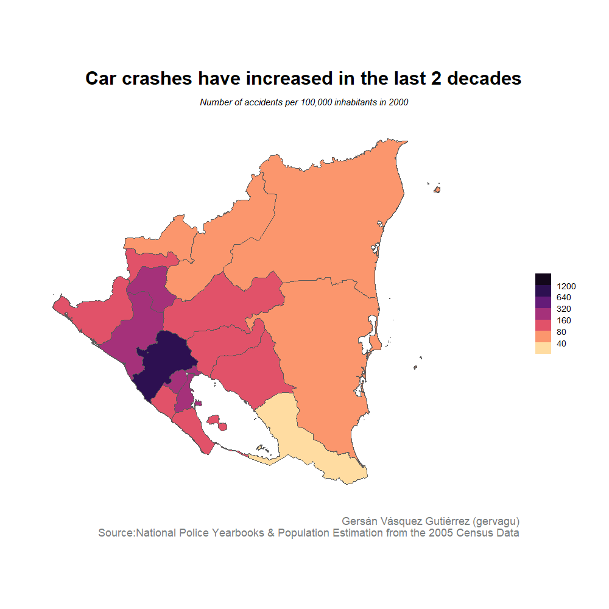

# Car Crashes in Nicaragua in the last two decades
Creating choropleth maps of car crashes in Nicaragua using `Tidyverse`

## Simple choropleth map

## Animated choropleth map

## Data
The data comes from the [National Police Yearbooks](https://www.policia.gob.ni/cedoc/sector/estd/fich.htm) and [the Population Estimation from the 2005 Nicaraguan Census Data](https://www.inide.gob.ni/Home/Anuarios). 
